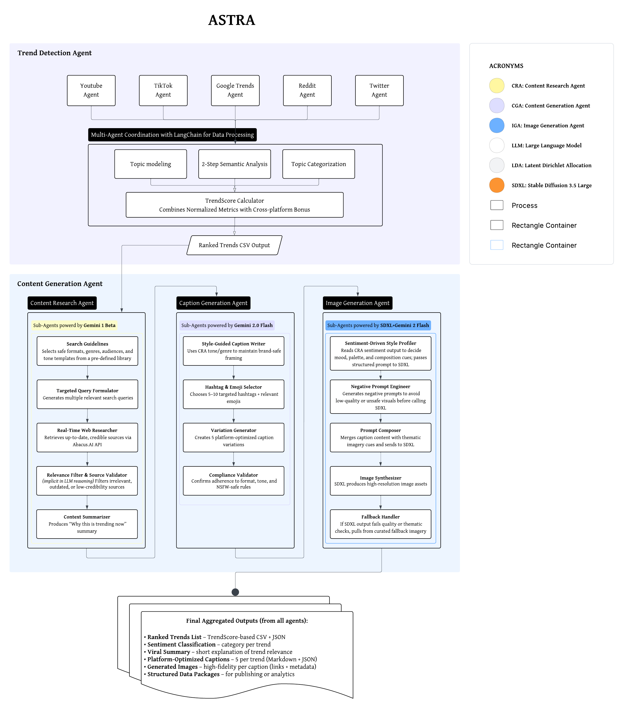

## ai-langchain-meta

Agentic AI pipeline for trend detection and content generation, with a React web dashboard and automated GitHub Actions workflows.

### Architecture


### Architecture at a glance
- Data collection agents fetch platform signals and persist CSV outputs in-repo
- Trend detection consolidates and scores signals across platforms
- Content generation creates captions, images, and summaries from top trends
- Web dashboard serves the latest consolidated CSVs for visualization

### Repo layout
- `1_data_collection/`
  - Collectors/scrapers for platforms (Reddit, Twitter/X, YouTube, Google Trends, TikTok)
  - Outputs are written as CSV/JSON and optionally committed by GitHub Actions
- `2_trend_detection/`
  - `final_langchain/`: productionized consolidation/scoring pipeline
    - Reads latest CSVs (glob patterns like `Scraped_Data/*.csv` if configured) and exports consolidated results to `final_output/`
  - `langchain_old/`: historical experiments and baselines
- `3_content_generation/`
  - Caption and image prompt generation (Abacus.AI workflow integration and helpers)
- `4_web_dashboard/`
  - React app that reads consolidated CSVs directly (no DB dependency by default)
  - See `public/` for example CSVs and static assets
- `final_output/`
  - Consolidated and categorized CSVs generated by the trend detection pipeline
- `final_deliverables/`
  - Final reports, slides, and demo media. Browse in GitHub: [`final_deliverables/`](final_deliverables/)
    - [`finalpaper_ASTRA.pdf`](final_deliverables/finalpaper_ASTRA.pdf)
    - [`finalpt_slide.pdf`](final_deliverables/finalpt_slide.pdf)
    - [`web-dashboard-demo.mp4`](final_deliverables/web-dashboard-demo.mp4)


### GitHub Actions workflows
Workflows live in `.github/workflows/` and are designed to run on a schedule or via manual dispatch:
- Data collection
  - `run-google-trends.yml` → runs `1_data_collection/google_trend_agent.py`
  - `run_reddit_agent.yml` → runs `1_data_collection/reddit_agent.py`
  - `run-twitter-agent.yml` → runs `1_data_collection/twitter_agent.py`
  - `tiktokscrapewf.yml` → runs `1_data_collection/trend24_collector_github.py` and `1_data_collection/tiktok_fetch_github.py`
  - `run_tiktok2_agents.yml` → runs `1_data_collection/tiktok_script_llm_support.py`
  - `tiktok_hashtags.yml`, `tiktok_hashtag_test.yml` → TikTok hashtag scrapers (xvfb headless)
- Trend detection
  - `run-langchain-agent.yml` → runs `2_trend_detection/final_langchain/final_main_execution.py`
- Utilities
  - `consolidate-csv-outputs.yml` → sample CSV consolidation job

Ensure collectors either commit their outputs to the repo (e.g., into `Scraped_Data/`) or upload artifacts that subsequent jobs can consume.

### Secrets and configuration
Set the following in GitHub → Settings → Secrets and variables → Actions:
- Required
  - `OPENAI_API_KEY` (trend detection LLM)
  - `GEMINI_API_KEY` (TikTok LLM collector)
  - `REDDIT_CLIENT_ID`, `REDDIT_CLIENT_SECRET`, `REDDIT_USER_AGENT` (Reddit collector)
  - `GCP_SA_KEY_BASE64` (Google Trends; base64 of service account JSON)
  - `ABACUSAPIKEY` (content generation workflow)
- Optional (if used)
  - `YOUTUBE_API_KEY`, `SUPABASE_URL`, `SUPABASE_SERVICE_KEY`

Local development can also use a `.env` at the project root; the code reads environment variables via `os.getenv(...)` and `load_dotenv()` where applicable.

### Quick start (local)
1) Python setup
```
pip install -r requirements.txt
```
2) Run a collector, e.g. Google Trends
```
python 1_data_collection/google_trend_agent.py
```
3) Run trend detection
```
python 2_trend_detection/final_langchain/final_main_execution.py
```
4) Content generation (optional)
```
python 3_content_generation/caption_agent.py --topic "Your Topic"
```
5) Web dashboard
```
cd 4_web_dashboard && npm install && npm start
```

### Notes
- Large binary deliverables are kept in `final_deliverables/` and linked above for browsing
- If you plan to store large media, consider using Git LFS
